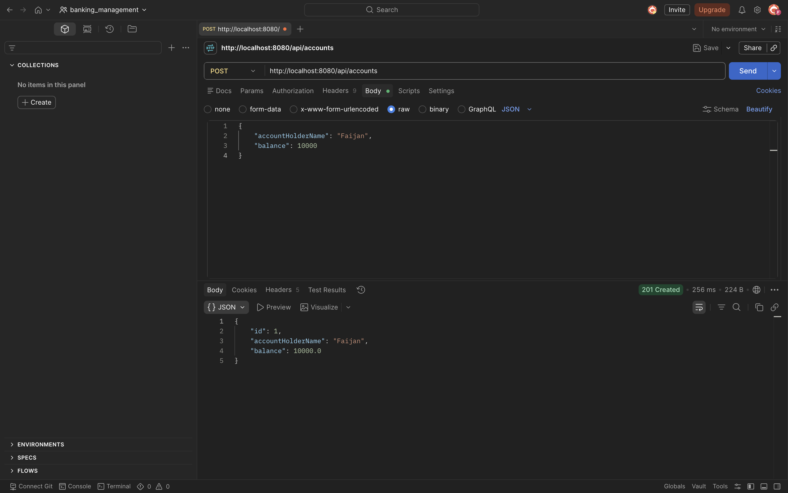
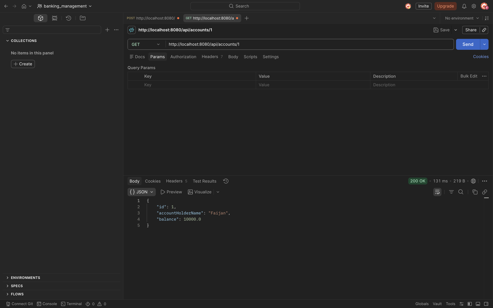
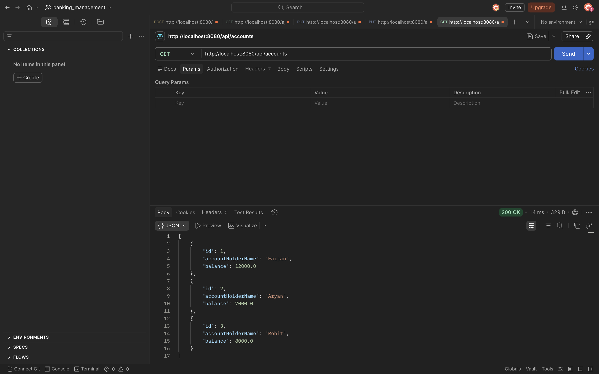
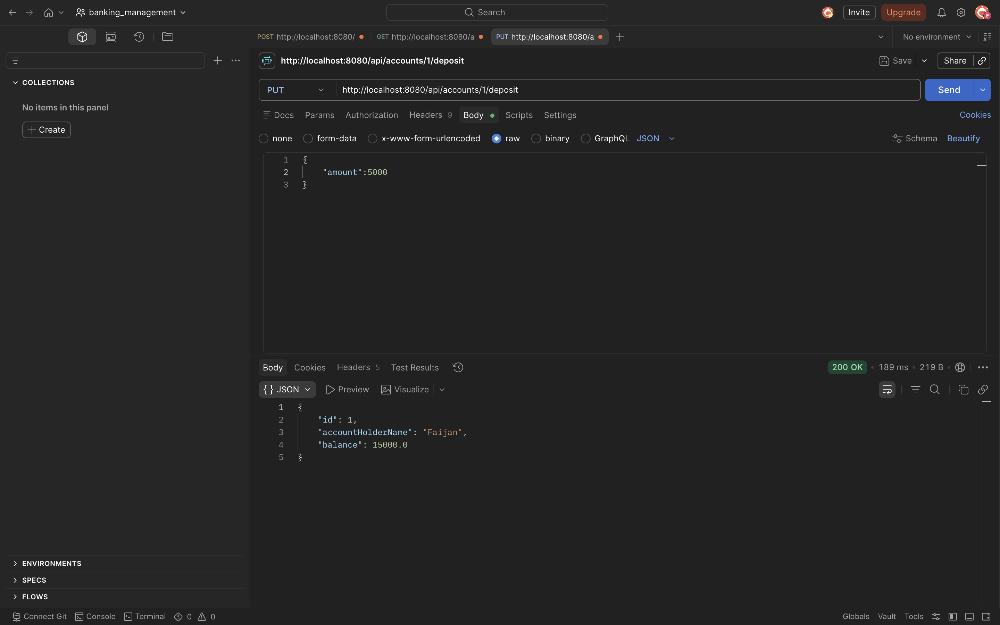
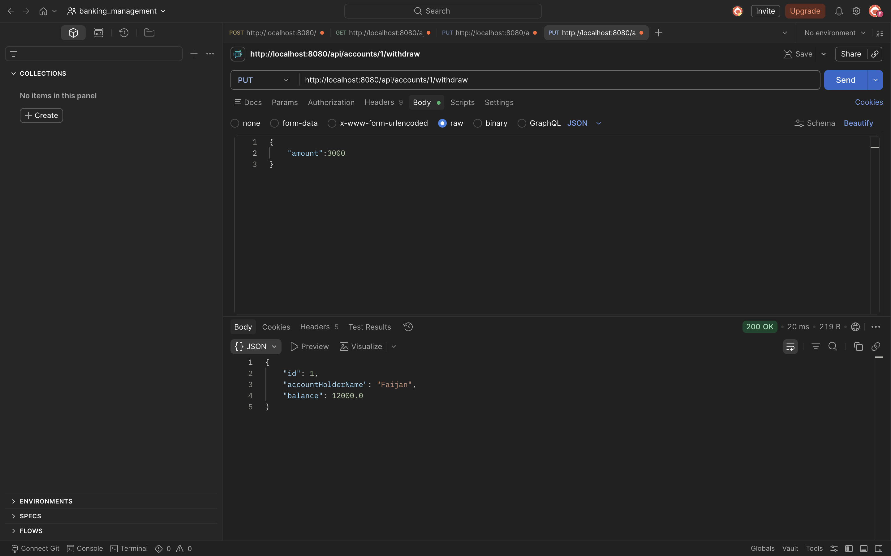
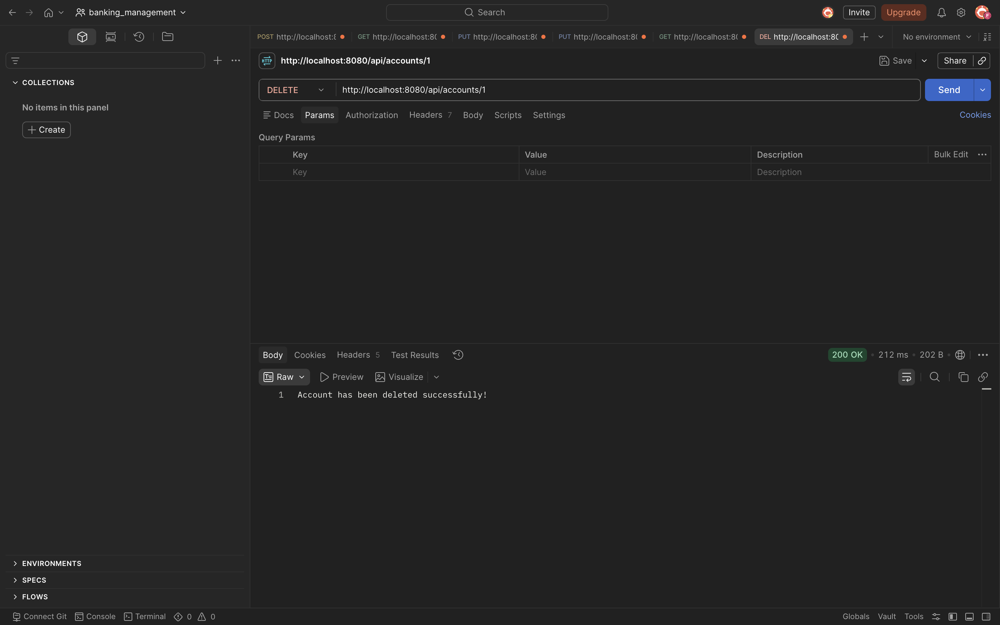
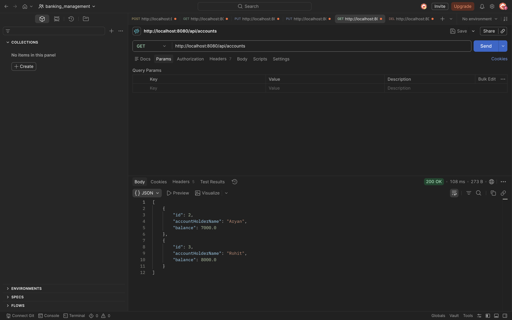
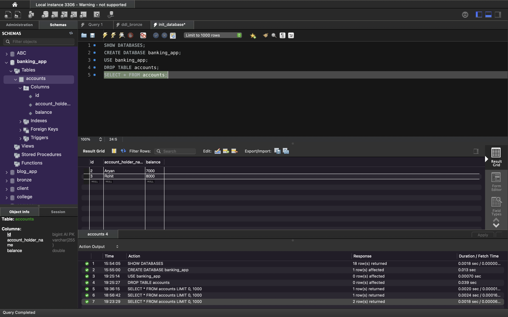
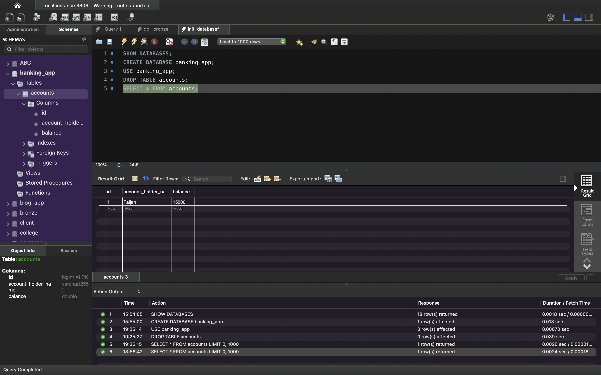
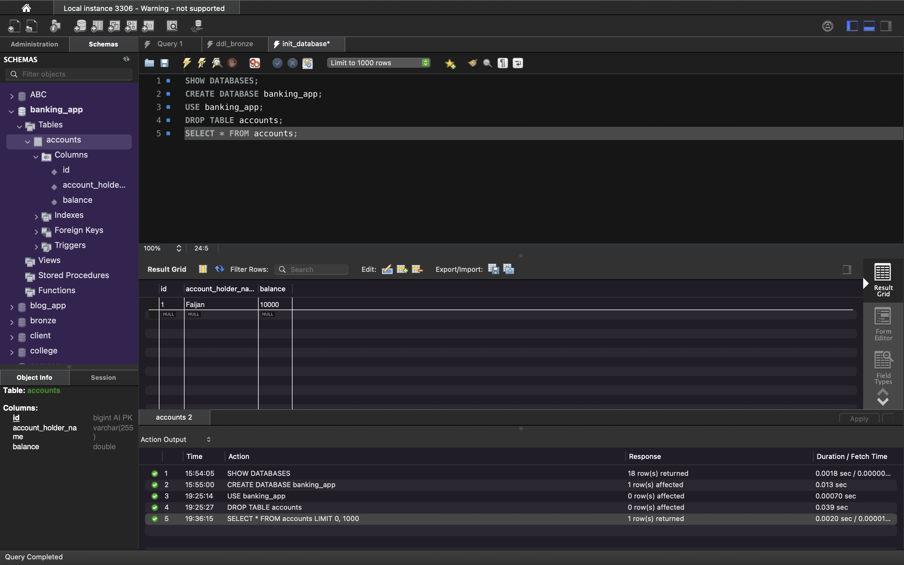

# Banking Management System

A RESTful Banking Management System built using Spring Boot and MySQL that allows users to create bank accounts, perform deposits and withdrawals, retrieve account details, and manage accounts through REST APIs.

## Project Overview

This project demonstrates the implementation of a layered Spring Boot application following industry-standard architecture practices. The application provides core banking operations and exposes REST APIs for account management.

The project focuses on:

* REST API Development
* Layered Architecture
* Spring Data JPA Integration
* Database Operations using MySQL
* DTO and Mapper Pattern
* CRUD Operations
* Clean Code Structure

---

## Features

### Account Management

* Create a new bank account
* Retrieve account details by ID
* Retrieve all accounts
* Delete an account

### Banking Operations

* Deposit money into an account
* Withdraw money from an account

---

## Tech Stack

### Backend

* Java 17
* Spring Boot 3.5.15
* Spring Data JPA
* Hibernate
* Maven
* Lombok

### Database

* MySQL

### API Testing

* Postman

---

## Project Architecture

```text
Controller Layer
       ↓
Service Layer
       ↓
Repository Layer
       ↓
MySQL Database
```

### Package Structure

```text
src/main/java/net/javaguides/banking

├── controller
├── dto
├── entity
├── mapper
├── repository
├── service
│   └── impl
└── BankingAppApplication
```

---

## API Endpoints

### Create Account

```http
POST /api/accounts
```

### Get Account By ID

```http
GET /api/accounts/{id}
```

### Get All Accounts

```http
GET /api/accounts
```

### Deposit Money

```http
PUT /api/accounts/{id}/deposit
```

Request Body

```json
{
  "amount": 5000
}
```

### Withdraw Money

```http
PUT /api/accounts/{id}/withdraw
```

Request Body

```json
{
  "amount": 3000
}
```

### Delete Account

```http
DELETE /api/accounts/{id}
```

---

## Database Configuration

Update the following properties in `application.properties`:

```properties
spring.datasource.url=jdbc:mysql://localhost:3306/banking_app
spring.datasource.username=root
spring.datasource.password=your_password

spring.jpa.hibernate.ddl-auto=update
spring.jpa.show-sql=true
```

---

## Running the Project

### Clone Repository

```bash
git clone <repository-url>
```

### Navigate to Project

```bash
cd banking-management-system
```

### Run Application

```bash
mvn spring-boot:run
```

Application will start on:

```text
http://localhost:8080
```

---

## Screenshots

### Postman API Testing

* Create Account

* Get Account By ID

* Get All Accounts

* Deposit Money

* Withdraw Money

* Delete Account

* Get All Accounts after deletion



### MySQL Database

Add screenshots showing:

* Account Records

* Updated Balances

* Table Structure

---

## Future Enhancements

* Account-to-Account Money Transfer
* Transaction History Management
* JWT Authentication & Authorization
* Unit and Integration Testing
* Docker Containerization
* Swagger/OpenAPI Documentation

---

## Key Learning Outcomes

Through this project, I gained hands-on experience with:

* Spring Boot REST API Development
* Spring Data JPA & Hibernate
* MySQL Integration
* Layered Architecture Design
* DTO and Mapper Pattern
* CRUD Operations
* Maven Dependency Management
* API Testing using Postman

---

## Author

Faijan Ahamed

LinkedIn: https://www.linkedin.com/in/faijanahamed/

GitHub: https://github.com/faijanahamed11

```
```
